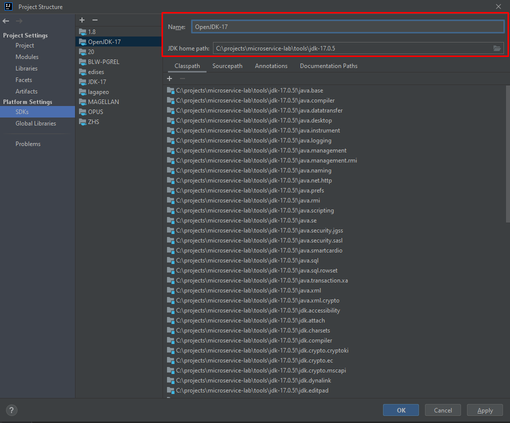
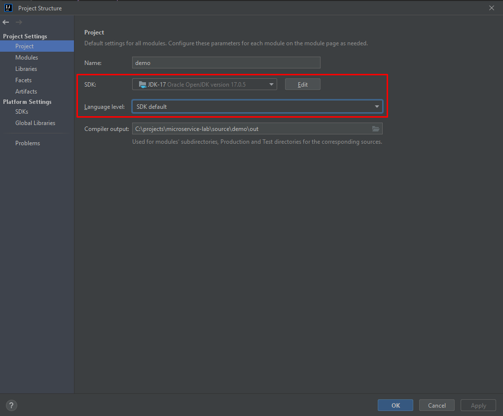
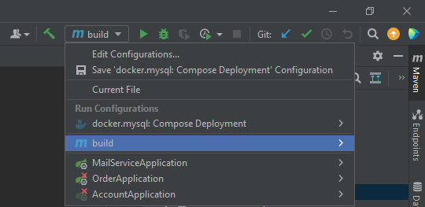
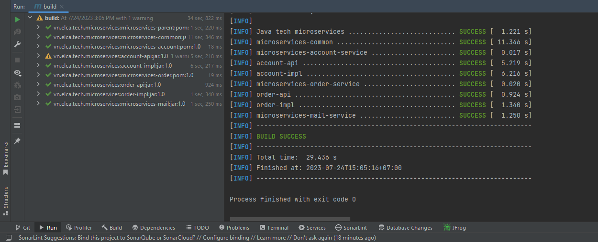
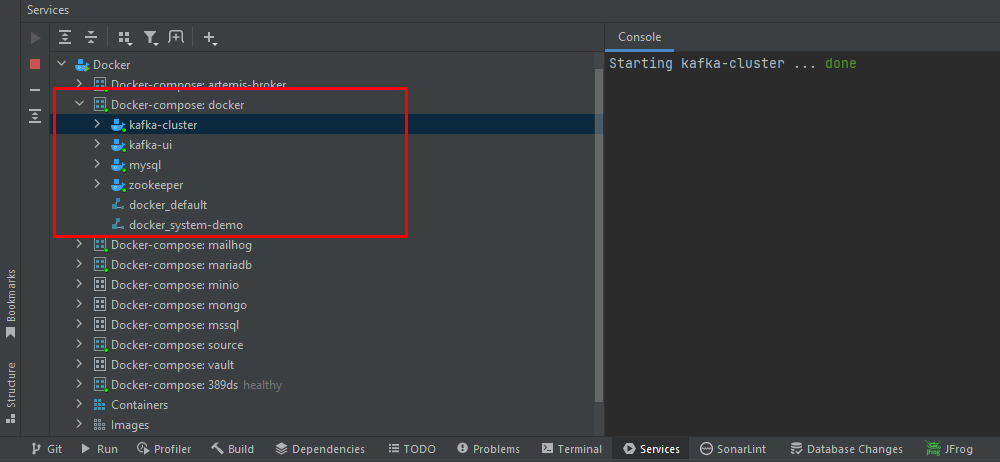
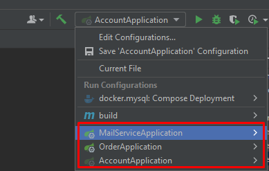
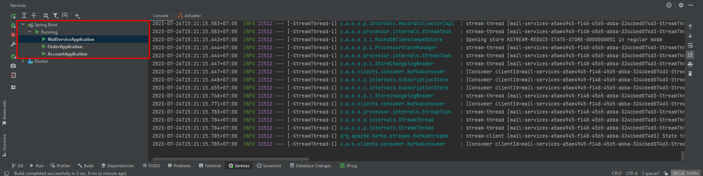

# Project DEMO
## I. Note for development
### 1. Installation
1. Create project base folder (E.g: C:\projects\microservice-lab)
2. Install necessary tools for development to C:\projects\microservice-lab\tools
    - Install Maven (v.3.8.1) to C:\projects\microservice-lab\tools\apache-maven-3.8.1
    - Install OpenJDK17 to C:\projects\microservice-lab\tools\jdk-17.0.5
    - Install IntelliJ IDE
    - Install Docker engine (or Docker desktop) to run infrastructure (mysql, kafka)
3. Create git source folder in ${project_base_dir}\source and checkout from Git server by clone the URL git@github.com:buituancanh/kafka-microservices.git
### 2. Build and run back-end application.
1. Import source modules into IntelliJ
    - Open IntelliJ and import the pre-configure project by click on Menu File -> Open then browse to ${project_base_dir}\source\
    - The project is supposed to be OK with the default configuration for IntelliJ.
2. Add JDK17 to IntelliJ
    - Open module setting and add JDK 17 to IDE JDK configuration
      
    - Config project JDK
      
3. Turn on annotation processor under Compiler tab
   - Open menu File -> Settings -> Build, Execution, Deployment -> Compiler -> Annotation Processors
   - Check on checkbox 'Enabled annotation processing'
4. Build maven project
   - Open Run/Debug configuration and select Maven:build
     
   - Run maven build goal and check result
     
5. Run database and kafka by docker
   - Start docker engine (or docker desktop)
   - Open CMD -> go to etc/docker and execute:
   ```bash
          docker-compose up
   ```
   - Verify the status of these containers
     
6. Init database
   Connect to database server and execute SQL script in `etc/sql/init.sql`
7. Start application
   - Start 3 services in Run/Debug configuration selection
     
   - Verify status:
     
### 3. Execute test
1. Init user and address manually in DB
2. Open Kafka UI by opening `http://localhost:8088/ui/clusters/local/all-topics?perPage=25&hideInternal=true`
3. Open `etc/data/message.xml`, adapt message by updating user number (prepared in DB before at step #1), and produce message to kafka
4. Check result in event topic
